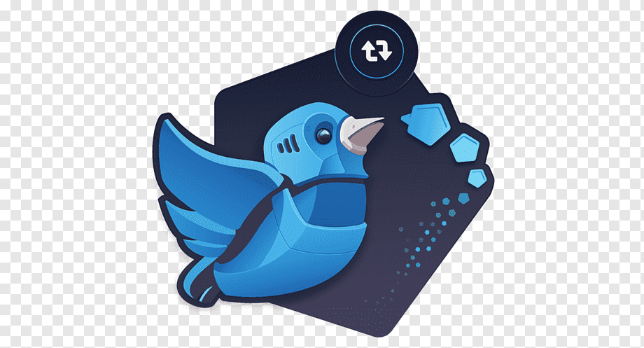

<h1 align="center">
    
    <p>TwitterBot</p>
</h1>

<h4 align="center"> 
	TwitterBot que da RT em hashtags escolhidas pelo usuário. 
</h4>

<div align="center">

[]()
[]()
[]()
[]()
[](/LICENSE)

</div>

## 📝 Conteúdo
<p align="center">
<a href="#installing">Instalando</a>&nbsp;&nbsp;&nbsp;|&nbsp;&nbsp;&nbsp;
<a href="#built_using">Tecnologias Utilizadas</a>&nbsp;&nbsp;&nbsp;|&nbsp;&nbsp;&nbsp;
<a href="#layout">Layout</a>&nbsp;&nbsp;&nbsp;|&nbsp;&nbsp;&nbsp;
<a href="#authors">Autor</a>
</p>


### ⚒ Instalando <a name = "installing"></a>
```bash
# Clone this repository
$ git clone https://github.com/fcsouza/twitter-bot

# Go into the repository
$ cd twitter-bot

# Get Secret API from twitter
env.example

# Install dependencies
$ yarn install
$ yarn src/bot.js

```

## ⛏️ Tecnologias Utilizadas <a name = "built_using"></a>

- [Twit](https://www.npmjs.com/package/twit) - Twitter API Client for node

## ✍️ Autor <a name = "authors"></a>

- [@fcsouza](https://github.com/fcsouza)

## 🗒 Licença

Esse projeto está sob a licença MIT. Veja o arquivo [LICENSE](LICENSE.md) para mais detalhes.